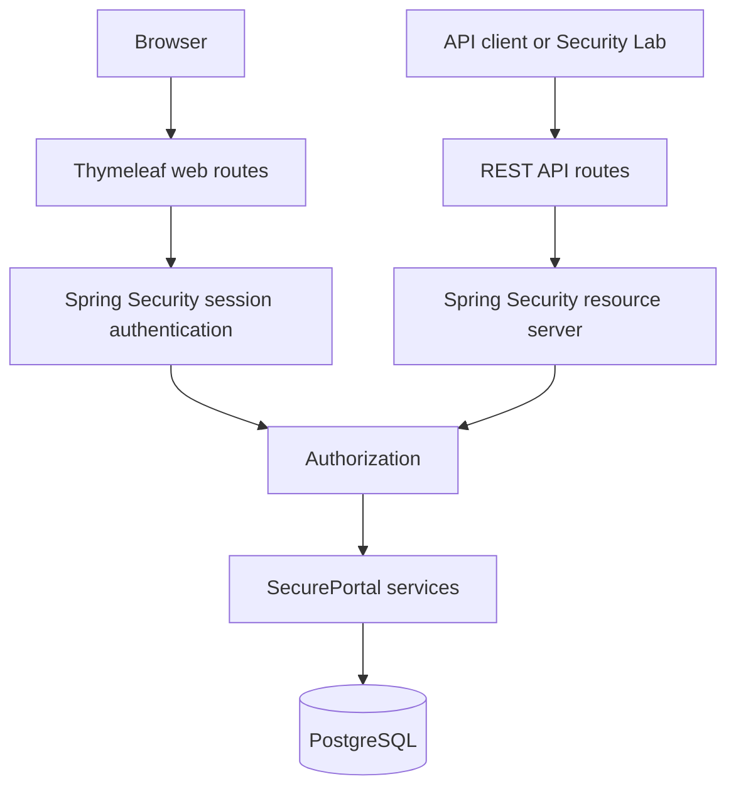

# Architecture

SecurePortal demonstrates two authentication mechanisms in one Spring Boot application. Browser routes use a server-side HTTP session; REST API routes use a stateless bearer JWT.

## Authorization model

Roles group permissions. Request-level rules protect routes, while method-level rules protect actions even after a request reaches a controller.

| Role | Selected permissions | Demonstration |
| --- | --- | --- |
| `USER` | `PROFILE_READ`, `PROFILE_WRITE`, `REPORT_READ` | Cannot access administration or generate reports. |
| `MANAGER` | User permissions plus `REPORT_GENERATE`, `USER_READ` | Can generate reports but cannot access administration. |
| `ADMIN` | All defined permissions, including `ADMIN_READ` | Can access administration routes and APIs. |

The Security Context page intentionally shows application roles and permissions only. Framework-provided authentication factors are not presented as application permissions.

## Evidence

The captured UI scenarios are included below:

- [Normal user dashboard](images/userportal.png)
- [Normal user access denied](images/adminaccessdenieled.png)
- [Administrator dashboard](images/adminportal.png)
- [Administrator security context](images/adminsecuritycontext.png)
- [JWT Security Lab](images/securitylabdemonstration.png)