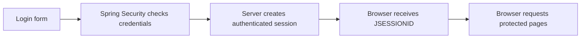

# Browser Security

This guide explains how the normal HTML part of SecurePortal works. It applies to the pages a person opens in a browser, such as `/login`, `/dashboard`, and `/admin`.

## The important idea

After a successful login, the browser receives a small cookie called `JSESSIONID`. The cookie is not the user's password. It is an opaque reference to a server-side session, where Spring Security stores the current authenticated user.

## What the code does

The two `SecurityFilterChain` beans in `SecurityConfiguration` separate browser and API security. The browser chain applies to non-`/api/**` routes.

| Route | Rule | Meaning |
| --- | --- | --- |
| `/`, `/login`, CSS, JavaScript | `permitAll()` | Anyone can open it. |
| `/dashboard`, `/profile`, `/security` | `authenticated()` | A valid browser session is required. |
| `/admin` | `hasRole("ADMIN")` | The session must include `ROLE_ADMIN`. |

`PortalUserDetailsService` loads the account from PostgreSQL, turns roles and permissions into Spring Security authorities, and hands those authorities to Spring Security. The password is checked by Spring Security against the hash generated by `PasswordEncoder`.

## Try it yourself

1. Open `http://localhost:58081/login`.
2. Sign in as `user` with `change-me-user`.
3. Open **Security context**. It shows `USER` and the permissions granted by that role.
4. Open `/admin` or use the dashboard's administration test link. You receive `403 Access denied` because the role does not include `ROLE_ADMIN`.
5. Sign out, sign in as `admin` with `change-me-admin`, and repeat. The administration page is allowed.

This shows why hiding an administration link is not security by itself. The `user` navigation does not show the link, but manually entering `/admin` is still denied by the server.

## CSRF protection

CSRF is relevant because browsers send session cookies automatically. Without protection, a malicious site could try to make a logged-in browser submit a request to SecurePortal.

Spring Security enables CSRF protection for the browser chain. Thymeleaf adds the required CSRF value to the login and logout forms. A `POST /logout` request without that value returns `403`; clicking **Sign out** works because the form contains it.

## Session fixation protection

An attacker might try to give someone a session ID before they log in, then reuse it later. Spring Security responds by replacing the session ID after successful login. This is why a test must use the post-login session, not the session created while the login page was viewed.

## Safe failure messages

Invalid passwords, unknown users, disabled accounts, and locked accounts all produce the same authentication failure response. The application intentionally does not tell a visitor which part was wrong, because that information can help account-enumeration attacks.