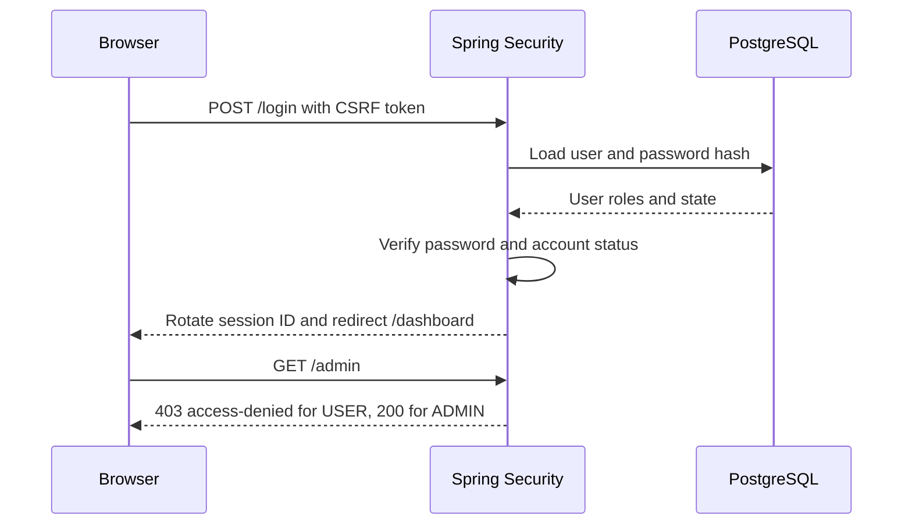
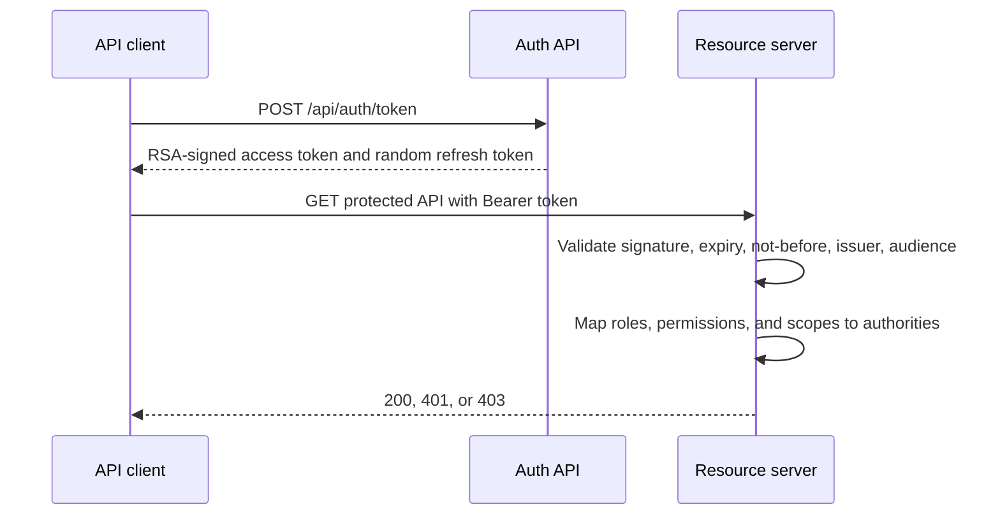
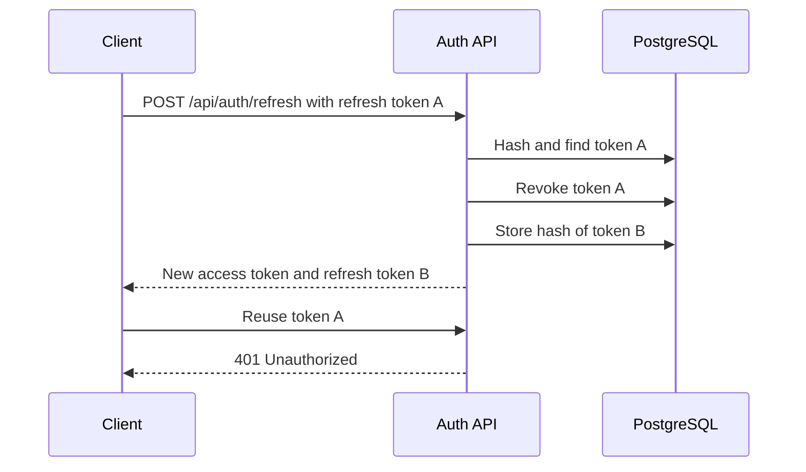

# Security Flows

## Browser login and session

The login response is intentionally generic for unknown, disabled, locked, and invalid-password accounts. This avoids confirming whether a username exists.

## JWT issuance and API authorization

Access tokens include only authorization claims: issuer, audience, subject, timestamps, JWT ID, roles, permissions, and scope. Never add credentials, refresh tokens, or private profile data to a signed JWT.

## Refresh token rotation

Only SHA-256 hashes of refresh tokens are stored. A refresh token is revoked before its replacement is returned, making it single-use.

## Test matrix

`SecurityIntegrationTest` verifies:

- Anonymous redirect, session logout CSRF protection, and session fixation behavior.
- Role-based web authorization and permission-based API authorization.
- Valid JWT authority mapping plus malformed, expired, wrong issuer, wrong audience, and invalid-signature rejection.
- Generic authentication failure for unknown, disabled, and locked accounts.
- Refresh-token replay rejection, CORS policy, static Security Lab assets, and health probes.