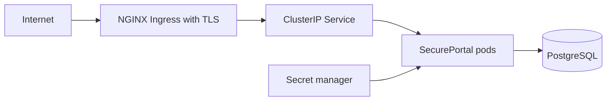

# Kubernetes Deployment

The manifests deploy two non-root SecurePortal replicas behind a ClusterIP Service and TLS-enabled NGINX Ingress. Update `portal.example.com`, the image reference, resource values, and database endpoint before applying them.



## Provision secrets

Do not apply `secret.example.yaml` and never commit real values. Create `secure-portal-secrets` through an external secret manager or your platform's secret mechanism. It must provide:

- `database-password`
- `jwt-public-key.pem`: X.509 RSA public key
- `jwt-private-key.pem`: PKCS#8 RSA private key

The application mounts the keys read-only and reads them through `JWT_PUBLIC_KEY_LOCATION` and `JWT_PRIVATE_KEY_LOCATION`. The production profile has no ephemeral signing key.

## Database choices

`postgresql.yaml` is an optional pinned PostgreSQL 17 StatefulSet with a 10 GiB persistent volume claim and health probes. It is suitable for local, development, and small non-critical clusters:

```shell
kubectl apply -f kubernetes/postgresql.yaml
```

For production, prefer an existing managed PostgreSQL service. Do not apply `postgresql.yaml`; instead, change `DATABASE_URL` in `configmap.yaml` to the existing service endpoint and keep `DATABASE_USERNAME` and the `database-password` secret aligned with that database.

## Apply application manifests

```shell
kubectl apply -f kubernetes/configmap.yaml
kubectl apply -f kubernetes/service.yaml
kubectl apply -f kubernetes/deployment.yaml
kubectl apply -f kubernetes/ingress.yaml
```

The Deployment uses `RuntimeDefault` seccomp, drops Linux capabilities, prohibits privilege escalation, uses a read-only root filesystem, and disables service-account token mounting. It exposes only the Actuator health endpoint, used by startup, liveness, and readiness probes.